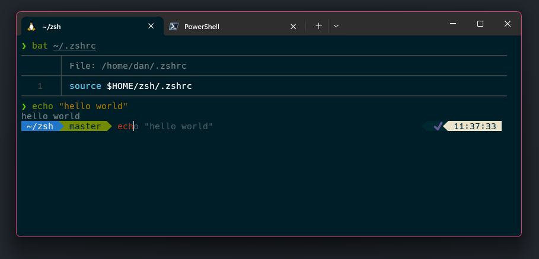

# Dan's oh-my-zsh config

0.  Install a [Nerd Font](https://www.nerdfonts.com/) and configure your
    terminal to use the installed font.

1.  Install [zsh](https://www.zsh.org/)

        sudo apt install zsh

2.  Make `zsh` your default shell

        chsh -s $(which zsh)
        
    Note: if you wish to run this command with `sudo`, you have to specify
    the current user:
    
        sudo chsh -s $(which zsh) $USER

3.  Clone this repo **with all submodules** to `~`

        git clone --recurse-submodules git@github.com:dstockhammer/zsh.git ~/zsh

4.  Create a `.zshrc` that references the configuration in this repository

        echo 'source $HOME/zsh/.zshrc' > ~/.zshrc

5.  Switch to `zsh` and enjoy 🌟🦄🌟

        zsh

    Alternatively, if you're already using `zsh` just reload your config:

        source ~/.zshrc

6.  Bonus: Update ohmyzsh and all themes/plugins:

        git submodule update --recursive --remote

## Windows Terminal + WSL



Settings for [Windows Terminal](https://github.com/microsoft/terminal) with
[WSL](https://docs.microsoft.com/en-us/windows/wsl/):

```javascript
{
    "guid": "{2c4de342-38b7-51cf-b940-2309a097f518}",
    "hidden": false,
    "name": "Ubuntu",
    "source": "Windows.Terminal.Wsl",
    "startingDirectory": "//wsl$/Ubuntu/home/daniel",
    "colorScheme": "Solarized Dark - Patched",
    "fontFace": "Hack NF",
    "fontSize": 12
}
```

Patched Solarized Dark theme from
[Windows Terminal Themes](https://atomcorp.github.io/themes/):

```javascript
{
    "name": "Solarized Dark - Patched",
    "black": "#002831",
    "red": "#d11c24",
    "green": "#738a05",
    "yellow": "#a57706",
    "blue": "#2176c7",
    "purple": "#c61c6f",
    "cyan": "#259286",
    "white": "#eae3cb",
    "brightBlack": "#475b62",
    "brightRed": "#bd3613",
    "brightGreen": "#475b62",
    "brightYellow": "#536870",
    "brightBlue": "#708284",
    "brightPurple": "#5956ba",
    "brightCyan": "#819090",
    "brightWhite": "#fcf4dc",
    "background": "#001e27",
    "foreground": "#708284"
}
```
